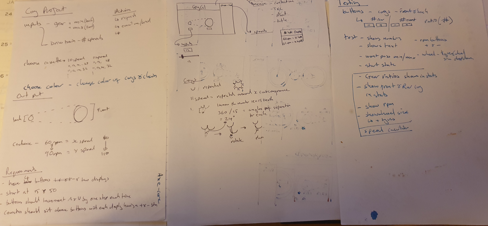

View Live - https://silly-dijkstra-000e73.netlify.app/

# Project outline

This is a project that is being built up using TDD at is core to build and develope the product.

The goal is to create a simple speed caculator for cyuclist to show the users statistics basesd on the selected set up.

Inputs:
- Rear and Front cog size, change up or down by one.
- Select Wheel size 
- Select Tyre size.
- Pedaling RPM

Outputs:
- Speed
- Gear Ratios 
- Gear Inches
- Cog sizes Front and Rear
- Cadance
- Wheel and tyre sizes

## Equations

Gear Inches:
Front cog / Rear cog x wheel sizer (inc tyre) = Gear Inches

Gear Ratio:
Front cog / Rear cog = Gear Ratio

Total Wheel Diameter = Rim Diameter + (Tyre Diameter \* 2) (in mm)

Wheel Circumferance = Total Wheel Diameter \* PI

Speed:
Tyre Cuircumferance(m) x Gear Ratio x RPM x 60(mins) = Km/h

wheel sizes:
28 inch - 635
27 inch - 630
29/700 - 622
650b/27.5 - 584
26 inch - 559
24 inch - 507
16 inch - 349

tyre:
20 mm 20.00
23 mm 23.00
25 mm 25.00
26 mm 26.00
27 mm 27.00
28 mm 28.00
30 mm 30.00
32 mm 32.00
35 mm 35.00
37 mm 37.00
38 mm 38.00
40 mm 40.00
42 mm 42.00
44 mm 44.00
45 mm 45.00
50 mm 50.00
56 mm 56.00
1.00 inch 25.40
1.25 inch 31.75
1.35 inch 34.29
1.40 inch 35.56
1.50 inch 38.10
1.75 inch 44.45
1.90 inch 48.26
1.95 inch 49.50
2.00 inch 50.80
2.10 inch 53.34
2.125 inch 54.00
2.20 inch 55.88
2.25 inch 57.15
2.30 inch 58.42
2.35 inch 59.69
2.40 inch 60.96
2.50 inch 63.50
2.60 inch 66.04
2.75 inch 69.85
2.80 inch 71.12
3.00 inch 76.20
3.80 inch 96.52
4.00 inch 101.60
4.25 inch 107.95
4.50 inch 114.30
4.60 inch 116.84
4.70 inch 119.38
4.80 inch 121.92
4.90 inch 124.46

## Technology

I have used Typescript on a React.js framework with Jest for testing.
This porject was mainly built to learn about how to use useContext to pass state between components. 

There were other potential testing frameworks that may be included later like Espresso but currently Jest is covering all required types from unit testing to UAT testing.

## Getting Started

Clone the Repo and then run the comands below

setup enviorment - $ npm start

Run tests - $ npm jest

## Planning

/_ eslint-enable _/
